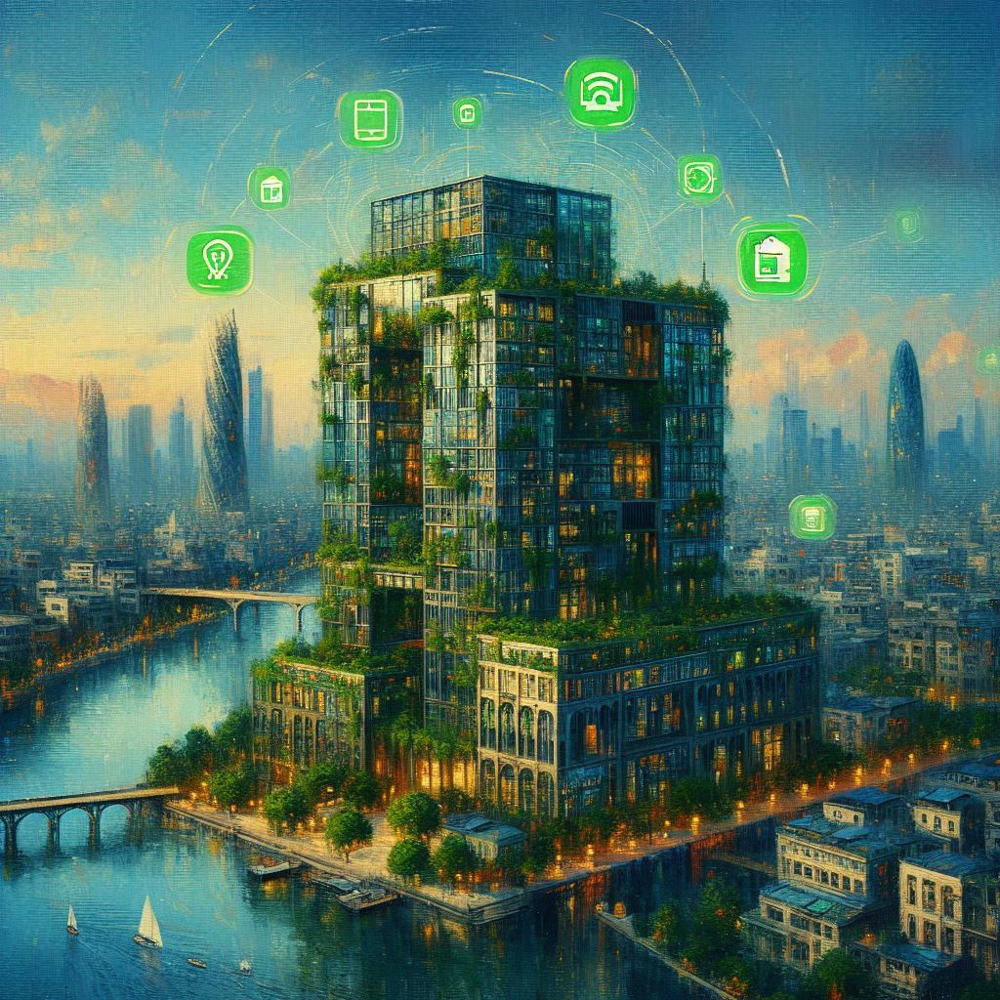

# Multi-agent AI sample for smart building

This repo contains a sample implementation of a multi-agent approach to helping optimize resources and planning for smart buildings.

It was built upon the work from [@TheovanKray](https://github.com/TheovanKraay): [LINK](https://github.com/AzureCosmosDB/multi-agent-swarm).

The agents can access and reason over:
- Digital twins of buildings sample json [here](https://github.com/JeromeVigne/smart-buildings-genAI-multi-agent/blob/main/smart-building.json).
- Real-time energy information from [ELECTRICITY MAPS](https://app.electricitymaps.com/map/12mo).
- Weather information from [HERE](https://www.weatherapi.com/).


Features:
- **Multi-agent**: [OpenAI Swarm](https://github.com/openai/swarm) to orchestrate multi-agent interactions with [Azure OpenAI](https://learn.microsoft.com/azure/ai-services/openai/overview) API calls.
- **Transactional data management**: planet scale [Azure Cosmos DB database service](https://learn.microsoft.com/azure/cosmos-db/introduction) to store digital twins of buildings unsing the NoSQL APIs for documents.
- **Retrieval Augmented Generation (RAG)**: [vector search](https://learn.microsoft.com/azure/cosmos-db/nosql/vector-search) in Azure Cosmos DB with powerful [DiskANN index](https://www.microsoft.com/en-us/research/publication/diskann-fast-accurate-billion-point-nearest-neighbor-search-on-a-single-node/?msockid=091c323873cd6bd6392120ac72e46a98) to help search unstructured data about the building characteristics..
- **Gradio UI**: [Gradio](https://www.gradio.app/) to provide a simple UI ChatBot for the end-user.





## Overview

This contains four main agents:

1. **Triage Agent**: Determines the type of request and transfers to the appropriate agent.
2. **Building Agent**: Answers questions about building characteristics, current occupancy, HVAC settings. It can also update the HVAC settings.
2. **Energy Mix Agent**: Gets the current energy mix for a certain region (type of energy source and renewable mix).
3. **Weather Agent**: Gets the weather forecast for a certain location, to help anticipate HVAC settings and energy consumption in the future.

## Prerequisites

- [Azure Cosmos DB account](https://learn.microsoft.com/azure/cosmos-db/create-cosmosdb-resources-portal) - ensure the [vector search](https://learn.microsoft.com/azure/cosmos-db/nosql/vector-search) feature is enabled.
- [Azure OpenAI API key](https://learn.microsoft.com/azure/ai-services/openai/overview) and endpoint.
- [Azure OpenAI Embedding Deployment ID](https://learn.microsoft.com/azure/ai-services/openai/overview) for the RAG model.
- You need to upload your document to a CosmosDB Account, select CosmosDb for NoSQL, create a container to upload your items. Make sure the container has Vector embedding pointing to the building_description_vector using the DISKANN index. You can use u_buildings.py to upload building digital twins.
- You need to create a local .env file or run the below shell to set your variables.
- Get an api key at [ELECTRICITY MAPS](https://app.electricitymaps.com/map/12mo)
- GEt an api key at [HERE](https://www.weatherapi.com/).

## Setup

Install dependencies:

```shell
pip install git+https://github.com/openai/swarm.git
pip install azure-cosmos==4.9.0
pip install gradio
```

Ensure you have the following environment variables set:
```shell
AZURE_COSMOSDB_ENDPOINT=your_cosmosdb_account_uri
AZURE_COSMOSDB_KEY=your_cosmosdb_account_key
AZURE_OPENAI_API_KEY=your_azure_openai_api_key
AZURE_OPENAI_ENDPOINT=your_azure_openai_endpoint
AZURE_OPENAI_EMBEDDINGDEPLOYMENTID=your_azure_openai_embeddingdeploymentid
ENERGY_MIX_API_KEY=your_api_key
WEATHER_API_KEY=your_api_key

```

Once you have installed dependencies, run below and click on url provided in output:

```shell
python3 src/app/ai_chat_bot.py
```

To see the agent handoffs, you can also run as an interactive Swarm CLI session using:
    
```shell
python3 src/app/multi_agent_service.py
```

